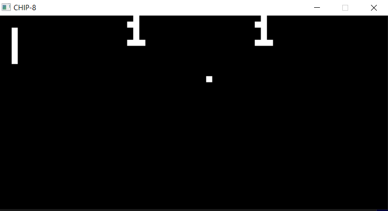

# CHIP-8 Interpreter
CHIP-8 interpreter written in C++.

Embedded Implementation: https://github.com/aaxbas/EmbeddedCHIP-8

## Compiling
Requires SDL2 and SDL2_mixer

TODO:
* Add Build Configuration info

## Resources
* http://www.multigesture.net/articles/how-to-write-an-emulator-chip-8-interpreter/
* http://en.wikipedia.org/wiki/CHIP-8
* http://devernay.free.fr/hacks/chip8/C8TECH10.HTM
